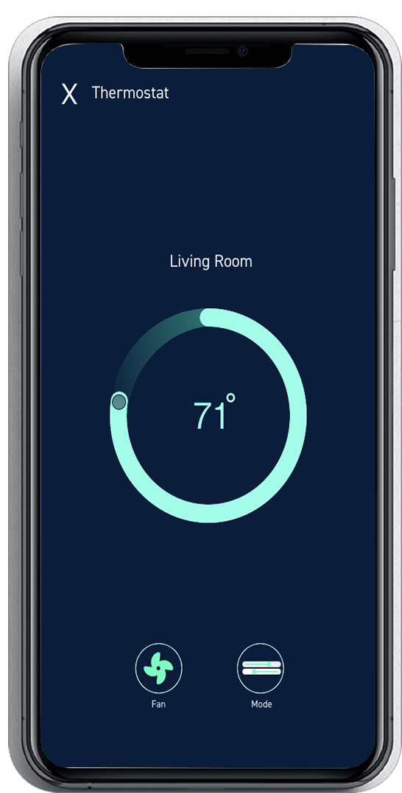

<h1 text-align="centre">My Favourite Things</h1>
All New ThermoSecurity by HouseCon! our new go to smart thermostat, ThermoSecurity has your family covered. Our new energy saving Technology will save you up to 20% on your heating
and air conditioner bills. 

 Creating a JSON object that contains at least 4 aspects (name, description, image, short story, age when I fell in love with it) - includes an svg accordingly. The three "things" are represented with an interactive control on the page (button in this case) - when the user engages with the control, it shows more data about the selected "thing".
 The controls use the JSON object as their data source - uses the Fetch API to retrieve the object on page load and immediately update the view/interface.

<h2>Requirements:</h2>
<ul>
<li>
utilize images, videos, 3D, etc.
</li>
<li>
use a JSOn object to showcase at least 4 properties 
</li>
<li>
must have title/heading (text), image(s) and desvriptive text
</li>
<li>
include a landing page with some controls to showcase each of my favourite things also include some kind of error handling if things go awry use an event and Fetch call to information specific to a favourite thing and showcase that information in a lightbox or something similar
</li>
</ul>

<h2>Meet the Developer:</h2>
<ul>
<li>Evica Mai <a href="https://github.com/evica-ai">@evica-ai</a></li>
</ul>

<h3>Prerequisites</h3>
All you need is a browser with a working Internet connection to view our works. Enjoy meeting or knowing more about me!

<h3>Built with:</h3>
<ul>
<li><a href="https://www.w3.org/TR/2008/WD-html5-20080122/">HTML 5</a></li>
<li><a href="https://www.w3.org/Style/CSS/Overview.en.html">CSS</a></li>
<li><a href="https://developer.mozilla.org/en-US/docs/Web/CSS/CSS_Animations">CSS Animations</a></li>
<li><a href="https://www.w3schools.com/js/DEFAULT.asp">Javascript</a></li>
<li><a href="https://www.adobe.com/ca/creativecloud/buy/students.html">Adobe After Effects and Illustrator</a></li>
</ul>

<h3>Usage<h3>
Check the main branch, clone/download the project (cd to your chosen directory)

<h2>License: MIT</h2>
